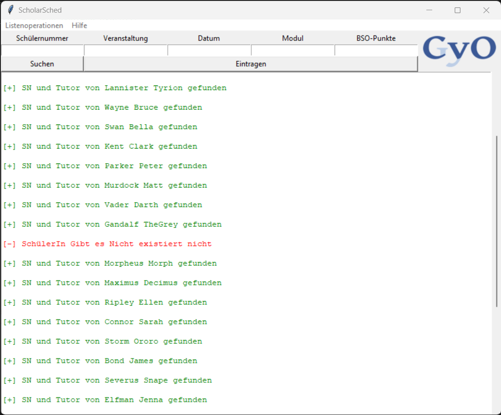
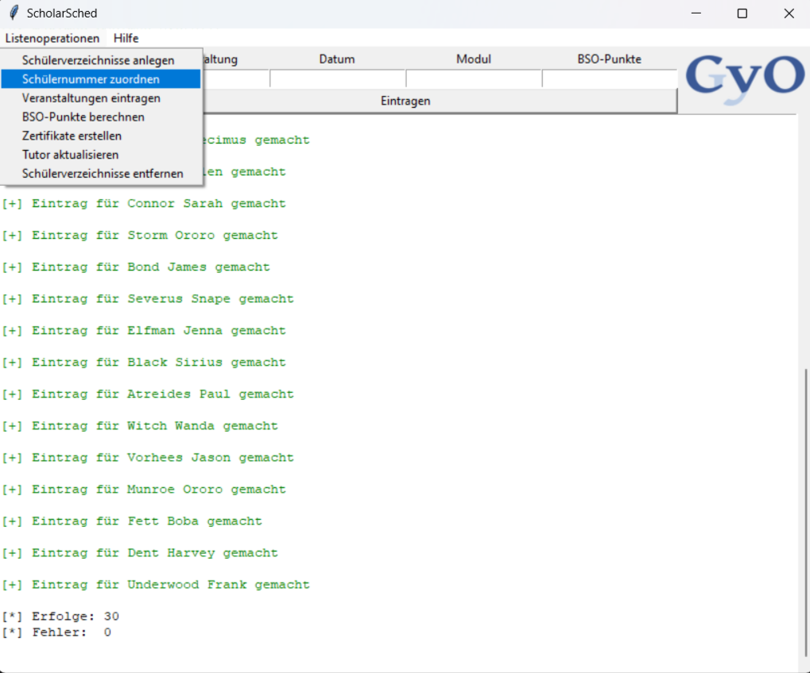

# ScholarSched

## Description

ScholarSched is a tool designed for school staff to manage CVE lists with student data, particularly their attended events. Key features include recording events, calculating points based on attendance, and generating certificates.

This tool was specifically designed for my school, CvO GyO.

## Screenshots

